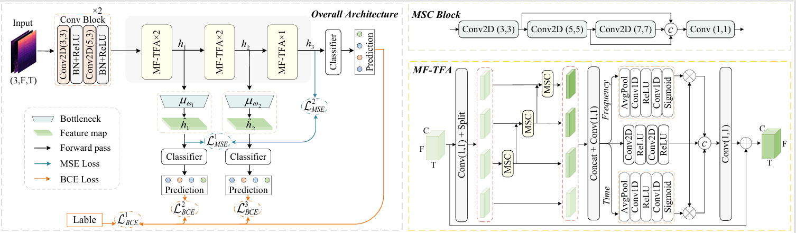

# MF-TFA_SD-MS
## Introduction
The official implementation of "A Singing Melody Extraction Network Via Self-Distillation and Multi-Level Supervision."

In this paper, we propose a singing melody extraction network
consisting of five stacked multi-scale feature time-frequency ag-
gregation (MF-TFA) modules. In the same network, deeper layers
generally contain more contextual information than shallower
layers. To help the shallower layers enhance the ability of task-
relevant feature extraction, we propose a self-distillation and
multi-level supervision (SD-MS) method, which leverages the fea-
ture distillation from the deepest layer to the shallower one and
multi-level supervision to guide network training. Visualization
analysis shows that by introducing SD-MS, the same-level layer in
the network can obtain a clearer representation of fundamental
frequency components, while the shallower layers can even learn
more task-relevant semantic information. Ablation study results
indicate that SD-MS applies to existing melody extraction models
and can consistently improve performance. Experimental results
show that our proposed method, MF-TFA with SD-MS, outper-
forms six compared state-of-the-art methods, achieving overall
accuracy (OA) scores of 87.1%, 89.9%, and 76.6% on the ADC
2004, MIREX 05, and MEDLEY DB datasets, respectively. 

## Important updata
The entire code scripts will be made public after being licensed.
